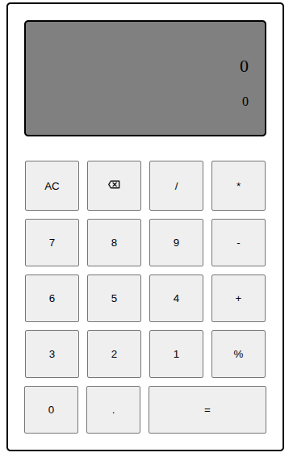

# 🔢 Calculator Web App

A simple, stylish web-based calculator built using HTML, CSS, and JavaScript.  
Performs basic arithmetic operations including addition, subtraction, multiplication, division, and modulo.

 <!-- Replace with actual path to your image -->

---

## 🚀 Features

- Basic arithmetic operations: `+`, `-`, `*`, `/`, `%`
- Real-time result display as you input values
- Rounded results up to 2 decimal places
- Graceful handling of edge cases (e.g. division by zero)
- Clear All (`AC`) and Clear Last Character functionality

---

## 🛠 Tech Stack

- **HTML5** for structure
- **CSS3** for styling
- **JavaScript (Vanilla)** for logic and interactivity

---

🔗 [Live Demo](https://thejas2246.github.io/calculator/)
